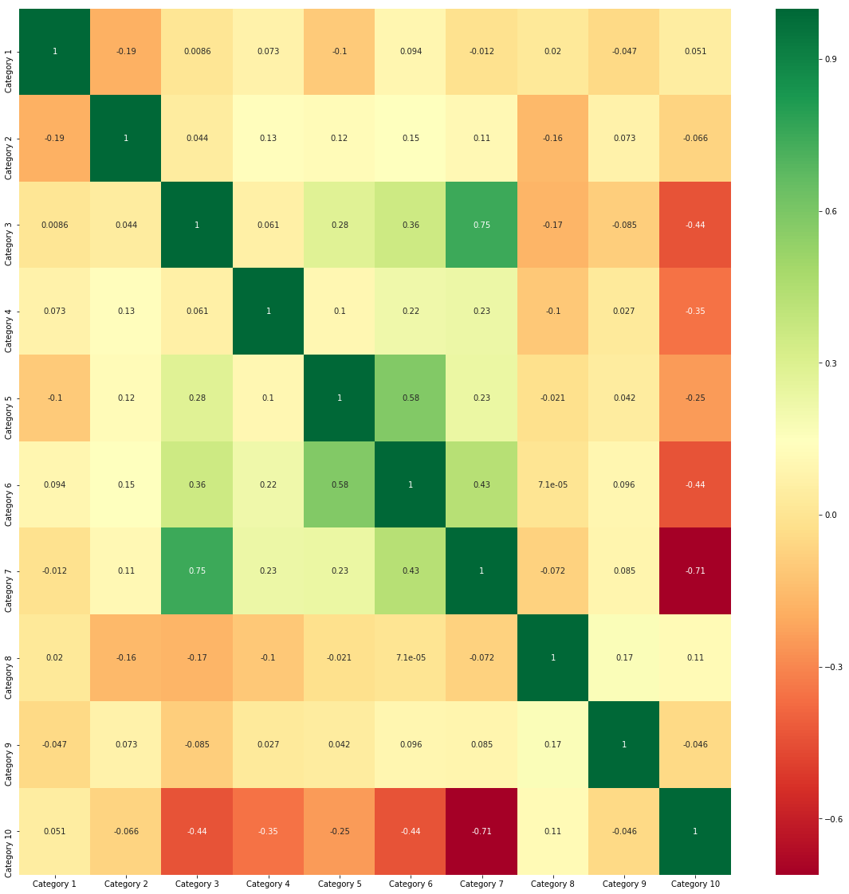
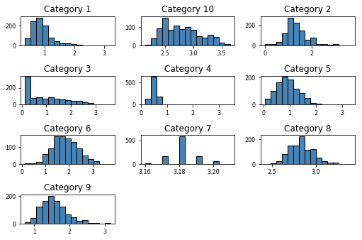
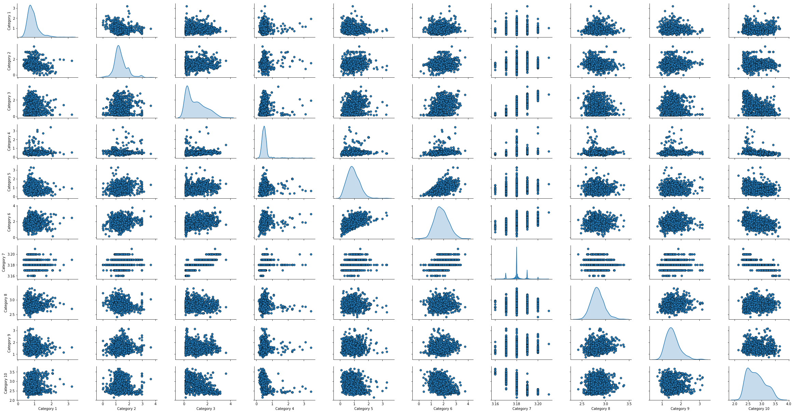
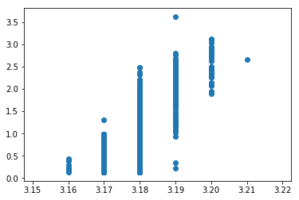
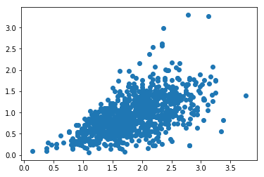
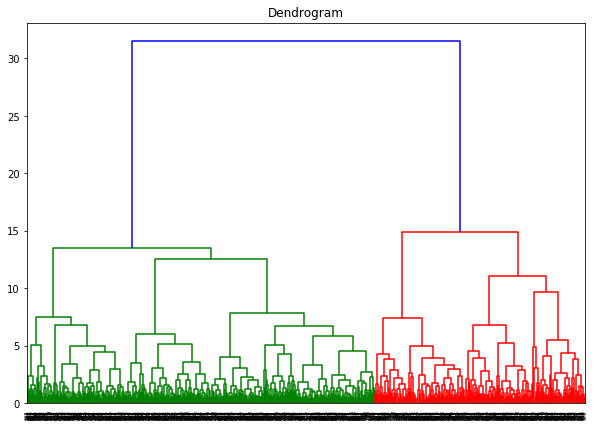
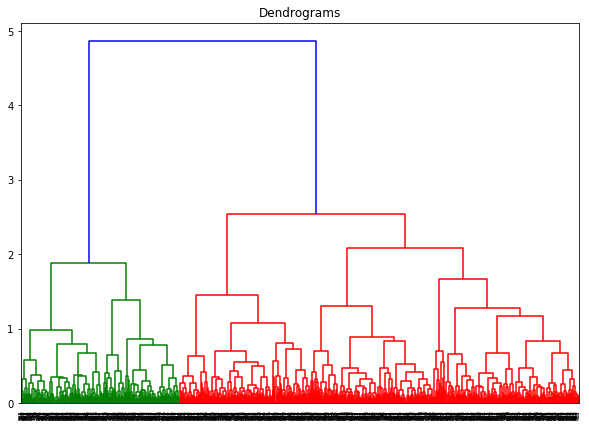
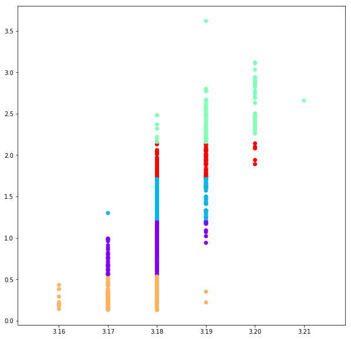
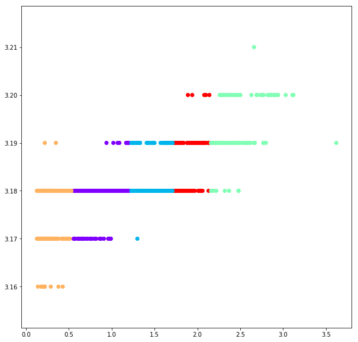

```python
import pandas as pd
import numpy as np
import matplotlib.pyplot as plt
import seaborn as sns
%matplotlib inline
```


```python
df=pd.read_csv('tripadvisor_review.csv',index_col=['User ID'])
```


```python
df.head()
```


<div>
<style scoped>
    .dataframe tbody tr th:only-of-type {
        vertical-align: middle;
    }

    .dataframe tbody tr th {
        vertical-align: top;
    }

    .dataframe thead th {
        text-align: right;
    }
</style>
<table border="1" class="dataframe">
  <thead>
    <tr style="text-align: right;">
      <th></th>
      <th>Category 1</th>
      <th>Category 2</th>
      <th>Category 3</th>
      <th>Category 4</th>
      <th>Category 5</th>
      <th>Category 6</th>
      <th>Category 7</th>
      <th>Category 8</th>
      <th>Category 9</th>
      <th>Category 10</th>
    </tr>
    <tr>
      <th>User ID</th>
      <th></th>
      <th></th>
      <th></th>
      <th></th>
      <th></th>
      <th></th>
      <th></th>
      <th></th>
      <th></th>
      <th></th>
    </tr>
  </thead>
  <tbody>
    <tr>
      <th>User 1</th>
      <td>0.93</td>
      <td>1.8</td>
      <td>2.29</td>
      <td>0.62</td>
      <td>0.80</td>
      <td>2.42</td>
      <td>3.19</td>
      <td>2.79</td>
      <td>1.82</td>
      <td>2.42</td>
    </tr>
    <tr>
      <th>User 2</th>
      <td>1.02</td>
      <td>2.2</td>
      <td>2.66</td>
      <td>0.64</td>
      <td>1.42</td>
      <td>3.18</td>
      <td>3.21</td>
      <td>2.63</td>
      <td>1.86</td>
      <td>2.32</td>
    </tr>
    <tr>
      <th>User 3</th>
      <td>1.22</td>
      <td>0.8</td>
      <td>0.54</td>
      <td>0.53</td>
      <td>0.24</td>
      <td>1.54</td>
      <td>3.18</td>
      <td>2.80</td>
      <td>1.31</td>
      <td>2.50</td>
    </tr>
    <tr>
      <th>User 4</th>
      <td>0.45</td>
      <td>1.8</td>
      <td>0.29</td>
      <td>0.57</td>
      <td>0.46</td>
      <td>1.52</td>
      <td>3.18</td>
      <td>2.96</td>
      <td>1.57</td>
      <td>2.86</td>
    </tr>
    <tr>
      <th>User 5</th>
      <td>0.51</td>
      <td>1.2</td>
      <td>1.18</td>
      <td>0.57</td>
      <td>1.54</td>
      <td>2.02</td>
      <td>3.18</td>
      <td>2.78</td>
      <td>1.18</td>
      <td>2.54</td>
    </tr>
  </tbody>
</table>
</div>


```python
cormat = df.corr()
top_corr_features = cormat.index
plt.figure(figsize=(20,20))
g=sns.heatmap(df[top_corr_features].corr(),annot=True,cmap="RdYlGn")
```





```python
df.info()
```

    <class 'pandas.core.frame.DataFrame'>
    Index: 980 entries, User 1 to User 980
    Data columns (total 10 columns):
    Category 1     980 non-null float64
    Category 2     980 non-null float64
    Category 3     980 non-null float64
    Category 4     980 non-null float64
    Category 5     980 non-null float64
    Category 6     980 non-null float64
    Category 7     980 non-null float64
    Category 8     980 non-null float64
    Category 9     980 non-null float64
    Category 10    980 non-null float64
    dtypes: float64(10)
    memory usage: 84.2+ KB
    


```python
df.describe()
```


<div>
<style scoped>
    .dataframe tbody tr th:only-of-type {
        vertical-align: middle;
    }

    .dataframe tbody tr th {
        vertical-align: top;
    }

    .dataframe thead th {
        text-align: right;
    }
</style>
<table border="1" class="dataframe">
  <thead>
    <tr style="text-align: right;">
      <th></th>
      <th>Category 1</th>
      <th>Category 2</th>
      <th>Category 3</th>
      <th>Category 4</th>
      <th>Category 5</th>
      <th>Category 6</th>
      <th>Category 7</th>
      <th>Category 8</th>
      <th>Category 9</th>
      <th>Category 10</th>
    </tr>
  </thead>
  <tbody>
    <tr>
      <th>count</th>
      <td>980.000000</td>
      <td>980.000000</td>
      <td>980.000000</td>
      <td>980.000000</td>
      <td>980.000000</td>
      <td>980.000000</td>
      <td>980.000000</td>
      <td>980.000000</td>
      <td>980.000000</td>
      <td>980.000000</td>
    </tr>
    <tr>
      <th>mean</th>
      <td>0.893194</td>
      <td>1.352612</td>
      <td>1.013306</td>
      <td>0.532500</td>
      <td>0.939735</td>
      <td>1.842898</td>
      <td>3.180939</td>
      <td>2.835061</td>
      <td>1.569439</td>
      <td>2.799224</td>
    </tr>
    <tr>
      <th>std</th>
      <td>0.326912</td>
      <td>0.478280</td>
      <td>0.788607</td>
      <td>0.279731</td>
      <td>0.437430</td>
      <td>0.539538</td>
      <td>0.007824</td>
      <td>0.137505</td>
      <td>0.364629</td>
      <td>0.321380</td>
    </tr>
    <tr>
      <th>min</th>
      <td>0.340000</td>
      <td>0.000000</td>
      <td>0.130000</td>
      <td>0.150000</td>
      <td>0.060000</td>
      <td>0.140000</td>
      <td>3.160000</td>
      <td>2.420000</td>
      <td>0.740000</td>
      <td>2.140000</td>
    </tr>
    <tr>
      <th>25%</th>
      <td>0.670000</td>
      <td>1.080000</td>
      <td>0.270000</td>
      <td>0.410000</td>
      <td>0.640000</td>
      <td>1.460000</td>
      <td>3.180000</td>
      <td>2.740000</td>
      <td>1.310000</td>
      <td>2.540000</td>
    </tr>
    <tr>
      <th>50%</th>
      <td>0.830000</td>
      <td>1.280000</td>
      <td>0.820000</td>
      <td>0.500000</td>
      <td>0.900000</td>
      <td>1.800000</td>
      <td>3.180000</td>
      <td>2.820000</td>
      <td>1.540000</td>
      <td>2.780000</td>
    </tr>
    <tr>
      <th>75%</th>
      <td>1.020000</td>
      <td>1.560000</td>
      <td>1.572500</td>
      <td>0.580000</td>
      <td>1.200000</td>
      <td>2.200000</td>
      <td>3.180000</td>
      <td>2.910000</td>
      <td>1.760000</td>
      <td>3.040000</td>
    </tr>
    <tr>
      <th>max</th>
      <td>3.220000</td>
      <td>3.640000</td>
      <td>3.620000</td>
      <td>3.440000</td>
      <td>3.300000</td>
      <td>3.760000</td>
      <td>3.210000</td>
      <td>3.390000</td>
      <td>3.170000</td>
      <td>3.660000</td>
    </tr>
  </tbody>
</table>
</div>


```python
from sklearn.cluster import KMeans
km=KMeans(n_clusters = 2)
```


```python
km.fit(df)
```


    KMeans(algorithm='auto', copy_x=True, init='k-means++', max_iter=300,
        n_clusters=2, n_init=10, n_jobs=None, precompute_distances='auto',
        random_state=None, tol=0.0001, verbose=0)


```python
km.cluster_centers_
```


    array([[0.88501672, 1.30989967, 0.49198997, 0.50036789, 0.78625418,
            1.62528428, 3.17697324, 2.8543311 , 1.59712375, 2.92548495],
           [0.90599476, 1.41947644, 1.82939791, 0.58280105, 1.18      ,
            2.18356021, 3.1871466 , 2.80489529, 1.52609948, 2.60157068]])


```python
df.shape
```


    (980, 10)


```python
df.isnull().sum()
```


    Category 1     0
    Category 2     0
    Category 3     0
    Category 4     0
    Category 5     0
    Category 6     0
    Category 7     0
    Category 8     0
    Category 9     0
    Category 10    0
    dtype: int64


```python
df.hist(bins=15,color='steelblue',edgecolor='black',linewidth=1.0,xlabelsize=8,ylabelsize=8,grid=False)
plt.tight_layout(rect=(0, 0, 1.2, 1.2))
```





```python
pp=sns.pairplot(df,height=1.8,aspect=1.8,
                plot_kws=dict(edgecolor="k",linewidth=0.5),
                diag_kind="kde", diag_kws=dict(shade=True))
fig = pp.fig
fig.subplots_adjust(top=0.93,wspace=0.3)
```





```python
x=df['Category 7']
y=df['Category 3']
plt.scatter(x,y)

plt.show()
```





```python
x=df['Category 6']
y=df['Category 5']
plt.scatter(x,y)
plt.show()
```





```python
from sklearn.preprocessing import normalize
data_scales = normalize(df)
data_scales = pd.DataFrame(data_scales,columns=df.columns)
data_scales.head()
```


<div>
<style scoped>
    .dataframe tbody tr th:only-of-type {
        vertical-align: middle;
    }

    .dataframe tbody tr th {
        vertical-align: top;
    }

    .dataframe thead th {
        text-align: right;
    }
</style>
<table border="1" class="dataframe">
  <thead>
    <tr style="text-align: right;">
      <th></th>
      <th>Category 1</th>
      <th>Category 2</th>
      <th>Category 3</th>
      <th>Category 4</th>
      <th>Category 5</th>
      <th>Category 6</th>
      <th>Category 7</th>
      <th>Category 8</th>
      <th>Category 9</th>
      <th>Category 10</th>
    </tr>
  </thead>
  <tbody>
    <tr>
      <th>0</th>
      <td>0.141236</td>
      <td>0.273359</td>
      <td>0.347774</td>
      <td>0.094157</td>
      <td>0.121493</td>
      <td>0.367516</td>
      <td>0.484453</td>
      <td>0.423707</td>
      <td>0.276397</td>
      <td>0.367516</td>
    </tr>
    <tr>
      <th>1</th>
      <td>0.142054</td>
      <td>0.306392</td>
      <td>0.370456</td>
      <td>0.089132</td>
      <td>0.197762</td>
      <td>0.442875</td>
      <td>0.447054</td>
      <td>0.366278</td>
      <td>0.259040</td>
      <td>0.323104</td>
    </tr>
    <tr>
      <th>2</th>
      <td>0.218947</td>
      <td>0.143572</td>
      <td>0.096911</td>
      <td>0.095116</td>
      <td>0.043072</td>
      <td>0.276376</td>
      <td>0.570698</td>
      <td>0.502501</td>
      <td>0.235099</td>
      <td>0.448662</td>
    </tr>
    <tr>
      <th>3</th>
      <td>0.075113</td>
      <td>0.300451</td>
      <td>0.048406</td>
      <td>0.095143</td>
      <td>0.076782</td>
      <td>0.253714</td>
      <td>0.530797</td>
      <td>0.494075</td>
      <td>0.262060</td>
      <td>0.477383</td>
    </tr>
    <tr>
      <th>4</th>
      <td>0.085531</td>
      <td>0.201250</td>
      <td>0.197896</td>
      <td>0.095594</td>
      <td>0.258271</td>
      <td>0.338771</td>
      <td>0.533312</td>
      <td>0.466229</td>
      <td>0.197896</td>
      <td>0.425979</td>
    </tr>
  </tbody>
</table>
</div>


```python
import scipy.cluster.hierarchy as shc
plt.figure(figsize=(10,7))
plt.title("Dendrogram")
dend=shc.dendrogram(shc.linkage(df,method='ward'))
```





```python
plt.figure(figsize=(10, 7))  
plt.title("Dendrograms")  
dend = shc.dendrogram(shc.linkage(data_scales, method='ward'))
plt.axhline(y=6, color='r', linestyle='--')
```


    <matplotlib.lines.Line2D at 0x21c7c965278>





```python
from sklearn.cluster import AgglomerativeClustering
df1 = df[['Category 3','Category 7']]

cluster = AgglomerativeClustering(n_clusters=5,affinity='euclidean',linkage='ward')
cluster.fit_predict(df1)
```


    array([2, 2, 3, 3, 0, 0, 3, 3, 0, 3, 0, 3, 2, 2, 2, 4, 4, 2, 1, 4, 0, 3,
           3, 3, 0, 2, 2, 1, 3, 2, 4, 2, 1, 3, 3, 0, 0, 0, 2, 3, 3, 3, 0, 3,
           3, 0, 0, 1, 3, 2, 3, 4, 0, 0, 3, 3, 2, 0, 2, 1, 2, 3, 3, 3, 0, 3,
           2, 0, 4, 0, 3, 2, 3, 2, 1, 1, 0, 2, 0, 3, 0, 0, 3, 0, 0, 3, 0, 3,
           3, 0, 0, 3, 2, 2, 4, 3, 2, 1, 2, 3, 3, 3, 1, 3, 0, 2, 0, 3, 3, 0,
           1, 1, 3, 1, 2, 3, 1, 0, 0, 0, 1, 3, 1, 0, 1, 3, 3, 0, 0, 3, 1, 0,
           4, 1, 3, 0, 1, 1, 0, 0, 3, 3, 0, 3, 3, 3, 3, 4, 0, 1, 0, 3, 3, 3,
           3, 1, 3, 0, 4, 0, 1, 3, 3, 0, 0, 3, 2, 0, 2, 1, 3, 3, 3, 3, 0, 3,
           0, 0, 3, 3, 3, 1, 1, 4, 2, 3, 3, 3, 1, 3, 2, 4, 3, 3, 3, 3, 1, 4,
           0, 3, 2, 3, 2, 3, 0, 3, 3, 3, 1, 0, 1, 4, 3, 3, 3, 1, 3, 3, 0, 4,
           3, 1, 2, 3, 4, 3, 3, 1, 0, 4, 3, 4, 3, 3, 3, 3, 1, 3, 0, 3, 2, 4,
           0, 0, 3, 0, 3, 4, 0, 3, 1, 3, 4, 4, 0, 0, 3, 3, 0, 1, 0, 0, 3, 4,
           3, 1, 2, 0, 3, 1, 3, 0, 4, 2, 1, 3, 1, 3, 3, 3, 1, 0, 2, 1, 3, 3,
           0, 0, 0, 0, 2, 3, 3, 0, 3, 0, 3, 1, 1, 3, 3, 2, 2, 3, 4, 3, 0, 2,
           3, 2, 3, 3, 1, 0, 0, 0, 4, 3, 2, 3, 3, 0, 3, 3, 0, 1, 2, 0, 1, 0,
           3, 4, 3, 3, 3, 1, 4, 3, 3, 0, 1, 4, 1, 2, 0, 3, 3, 0, 2, 2, 0, 3,
           1, 0, 0, 0, 3, 4, 3, 1, 3, 1, 4, 3, 0, 1, 0, 3, 1, 3, 1, 2, 0, 4,
           0, 2, 4, 3, 3, 3, 3, 3, 3, 4, 3, 2, 1, 3, 3, 3, 1, 0, 1, 3, 1, 1,
           1, 0, 3, 1, 3, 4, 3, 3, 4, 1, 4, 2, 4, 2, 0, 3, 4, 1, 3, 2, 0, 3,
           3, 1, 2, 0, 3, 3, 1, 3, 1, 3, 3, 3, 4, 0, 1, 4, 1, 3, 3, 3, 3, 3,
           0, 3, 3, 3, 1, 3, 0, 1, 1, 0, 3, 0, 0, 4, 0, 0, 3, 3, 4, 0, 0, 3,
           3, 1, 0, 4, 0, 3, 0, 3, 2, 3, 3, 3, 4, 4, 4, 0, 2, 1, 0, 1, 3, 4,
           4, 1, 3, 3, 0, 3, 4, 3, 3, 2, 3, 3, 3, 2, 4, 0, 4, 1, 2, 3, 3, 3,
           1, 4, 0, 3, 2, 3, 0, 2, 3, 2, 3, 4, 3, 3, 3, 4, 2, 3, 2, 1, 1, 3,
           3, 3, 3, 3, 1, 1, 4, 1, 2, 2, 0, 3, 0, 3, 3, 0, 0, 3, 3, 3, 0, 3,
           0, 2, 0, 0, 3, 2, 3, 3, 3, 3, 4, 2, 4, 1, 3, 1, 2, 2, 4, 3, 4, 3,
           4, 3, 0, 1, 3, 3, 3, 0, 0, 1, 0, 3, 3, 3, 0, 3, 2, 3, 0, 3, 3, 1,
           0, 1, 3, 3, 4, 3, 0, 3, 2, 3, 1, 0, 0, 0, 1, 3, 4, 1, 0, 3, 0, 3,
           3, 0, 3, 0, 3, 1, 4, 0, 1, 3, 1, 4, 3, 3, 3, 3, 3, 4, 0, 1, 1, 0,
           3, 3, 2, 3, 3, 3, 4, 3, 3, 3, 3, 0, 3, 3, 3, 3, 2, 2, 0, 0, 0, 3,
           2, 0, 2, 3, 1, 2, 4, 1, 0, 3, 3, 2, 1, 3, 3, 3, 3, 4, 0, 3, 3, 3,
           1, 3, 4, 4, 0, 3, 3, 0, 3, 0, 3, 3, 0, 3, 1, 3, 3, 1, 0, 1, 4, 3,
           3, 3, 3, 1, 3, 0, 1, 3, 3, 3, 0, 3, 3, 2, 2, 2, 3, 3, 0, 0, 3, 1,
           0, 0, 3, 4, 1, 3, 0, 2, 3, 3, 3, 4, 0, 3, 1, 1, 3, 3, 0, 3, 3, 3,
           3, 0, 2, 0, 1, 0, 0, 0, 3, 3, 1, 3, 1, 0, 0, 1, 1, 1, 3, 0, 3, 1,
           0, 0, 0, 3, 3, 1, 3, 0, 3, 3, 4, 4, 3, 3, 3, 2, 4, 3, 0, 1, 2, 2,
           1, 3, 3, 4, 3, 3, 2, 2, 3, 1, 2, 0, 1, 2, 3, 4, 4, 1, 3, 1, 1, 0,
           2, 1, 2, 1, 2, 2, 1, 0, 3, 4, 0, 1, 4, 0, 2, 0, 1, 3, 3, 3, 2, 2,
           1, 3, 3, 0, 0, 1, 4, 3, 3, 1, 3, 0, 4, 0, 3, 1, 3, 1, 1, 0, 1, 2,
           3, 2, 4, 3, 2, 3, 0, 3, 2, 3, 3, 0, 3, 3, 4, 0, 3, 0, 1, 3, 3, 0,
           3, 3, 0, 4, 0, 2, 3, 0, 1, 3, 0, 3, 2, 3, 3, 3, 0, 0, 0, 0, 1, 2,
           0, 3, 1, 1, 3, 2, 0, 0, 3, 0, 3, 1, 0, 2, 1, 0, 3, 0, 1, 3, 0, 1,
           2, 2, 1, 3, 3, 3, 0, 2, 1, 3, 3, 1, 0, 0, 1, 0, 1, 0, 2, 3, 3, 3,
           0, 3, 3, 1, 0, 2, 1, 1, 1, 2, 1, 0, 3, 3, 4, 0, 3, 2, 3, 3, 4, 0,
           3, 3, 3, 3, 3, 3, 4, 3, 0, 0, 3, 0], dtype=int64)


```python
plt.figure(figsize=(10,10))
plt.scatter(df['Category 7'],df['Category 3'],c=cluster.labels_,cmap='rainbow')
```


    <matplotlib.collections.PathCollection at 0x21c7e6529e8>





```python
plt.figure(figsize=(10,10))
plt.scatter(df['Category 3'],df['Category 7'],c=cluster.labels_,cmap='rainbow')
```


    <matplotlib.collections.PathCollection at 0x21c7e48af98>





```python

```
